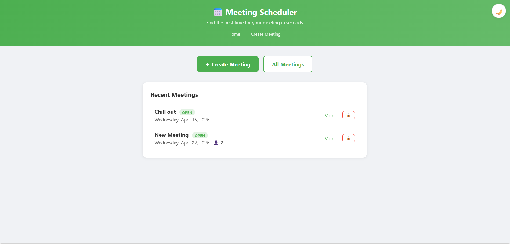
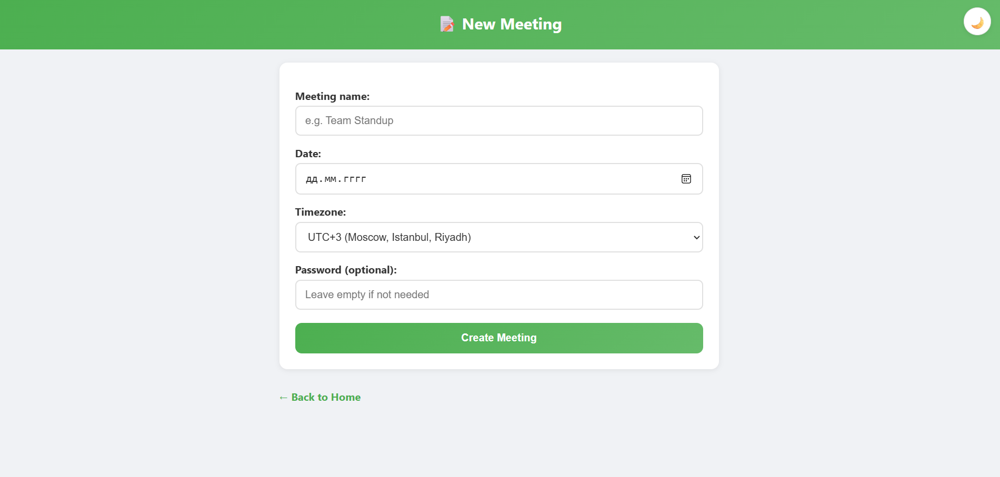
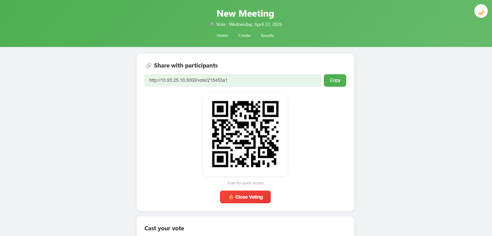
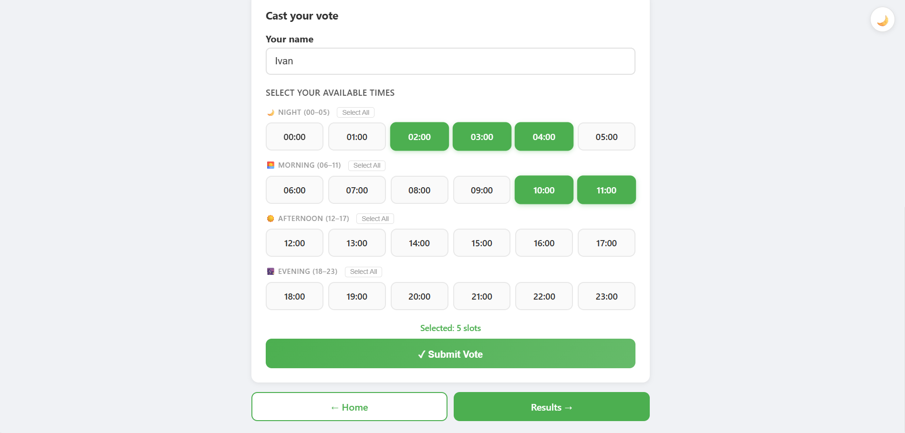
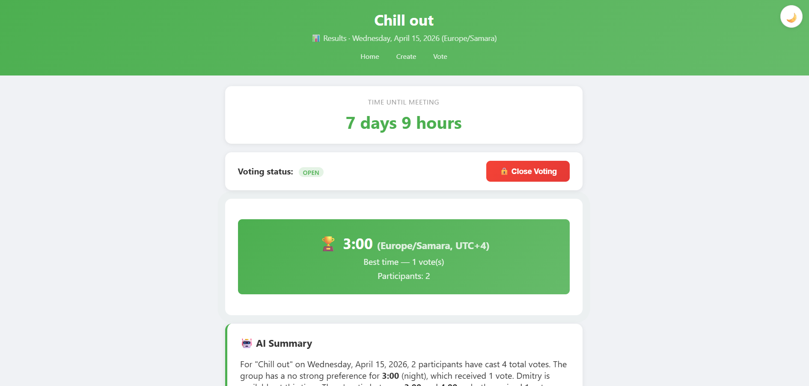
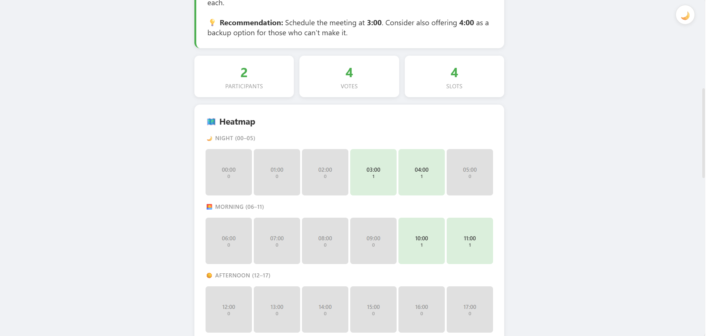
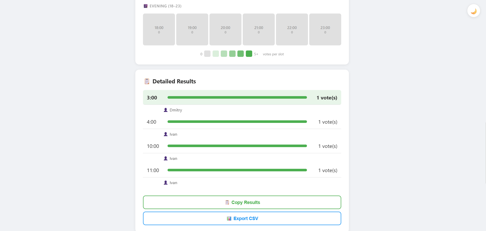
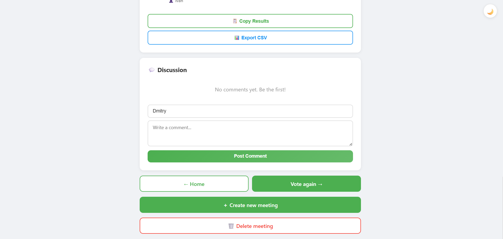

# Meeting Scheduler

A web application for finding the best meeting time based on participant availability.

## Demo

















## Context

**End users:** Student teams, work groups, friends

**Problem:** Hard to find a time when everyone is free. Endless messages like "does 3pm work?", "no, let's do 5pm"

**Solution:** Create a meeting → share the link → everyone marks their available slots → the app shows the best time

## Features

### Implemented
- ✅ Create meetings with name, date, and timezone
- ✅ Generate unique voting links
- ✅ Vote for available time slots (24 hours)
- ✅ Automatic best time calculation
- ✅ Results page with heatmap, stats, and detailed breakdown
- ✅ Password-protected meetings
- ✅ QR code generation for quick access (260×260, scannable)
- ✅ Countdown timer until meeting
- ✅ Copy results to clipboard / Export to CSV
- ✅ Confetti animation when a clear winner emerges
- ✅ Dark/light theme toggle (no flicker)
- ✅ Docker deployment
- ✅ Close voting — inline confirmation, blocks new votes
- ✅ Voting status badges (Open / Closed) on all pages
- ✅ UTC offset display on winning time and exports
- ✅ Timezone selector with UTC offsets and popular cities (UTC+0 → UTC+12)
- ✅ Discussion — threaded comments on result pages
- ✅ AI-powered summary of voting results

### Not yet implemented
- Email notifications / reminders
- Meeting calendar view
- Recurring meetings

## Usage

### Quick start (Docker — recommended)

```bash
docker-compose up -d
```

Open http://localhost:3000

### How to use the app

1. **Create a meeting** — click "Create Meeting", enter a title, pick a date, choose your timezone, and optionally set a password.
2. **Share the link** — after creating the meeting you'll get a unique voting URL (and a QR code). Send it to participants.
3. **Vote** — each participant opens the link, enters their name, and clicks the time slots they're available (24-hour grid).
4. **See results** — after voting the app automatically picks the best time, shows a heatmap, voter names, stats, and an AI-powered summary. You can also leave threaded comments.
5. **Close voting** — when enough people have voted, click "Close Voting" to stop new submissions.
6. **Export** — copy results to clipboard or download as CSV.

### Local setup (requires PostgreSQL)

1. Make sure PostgreSQL is running and create a database named `meeting_scheduler`.
2. Set environment variables if your credentials differ from the defaults (see table below).
3. Install dependencies and start the server:

```bash
npm install
npm start
```

Open http://localhost:3000

### Environment variables

| Variable | Description | Default |
|----------|-------------|---------|
| DB_HOST | Database host | localhost |
| DB_PORT | Database port | 5432 |
| DB_USER | Database user | postgres |
| DB_PASSWORD | Database password | postgres |
| DB_NAME | Database name | meeting_scheduler |
| PORT | Application port | 3000 |

## Deployment

### Docker (recommended)

```bash
docker-compose up -d
```

The app will be available at http://localhost:3000

### Ubuntu 24.04 VM

```bash
# Install Docker
curl -fsSL https://get.docker.com | sh

# Start the app
docker-compose up -d
```

## Project structure

```
├── server.js                  # Express server, all routes, AI summary logic
├── db.js                      # PostgreSQL pool & init
├── views/
│   ├── index.ejs              # Home — list of recent meetings
│   ├── create.ejs             # Create-meeting form
│   ├── vote.ejs               # Voting page (24-hour grid + QR code)
│   ├── result.ejs             # Results (heatmap, stats, AI summary, comments)
│   ├── meetings.ejs           # Full meetings list
│   ├── password.ejs           # Password prompt
│   ├── delete-confirm.ejs     # Delete-meeting confirmation
│   ├── error.ejs              # Error page
│   └── partials/
│       └── theme-init.ejs     # Flicker-free dark/light theme init
├── public/
│   ├── styles.css              # Global styles + dark/light theme
│   └── theme.js                # Client-side theme toggle
├── docker-compose.yml           # App + PostgreSQL services
├── Dockerfile                   # Node 20 slim image
├── package.json
└── README.md
```
